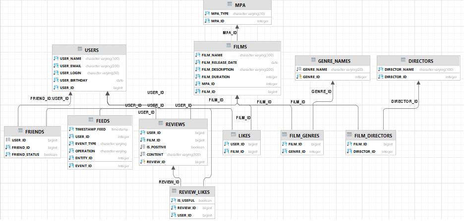

# java-filmorate
Template repository for Filmorate project.

примеры SQL запросов к БД:

получение всех фильмов:
"select  FILM_ID, FILM_NAME , FILM_RELEASE_DATE , FILM_DESCRIPTION ,FILM_DURATION , MPA.MPA_ID, MPA.MPA_TYPE " +
"from FILMS "+
"Join MPA ON MPA.MPA_ID=FILMS.MPA_ID";

получение всех пользователей:
"select USER_ID,USER_NAME,USER_EMAIL,USER_LOGIN,USER_BIRTHDAY " +
"from USERS"

топ N наиболее популярных фильмов:
"SELECT FILMS.FILM_ID, FILM_NAME , FILM_RELEASE_DATE , FILM_DESCRIPTION ,FILM_DURATION , MPA.MPA_ID, MPA.MPA_TYPE " +
"FROM FILMS "+
"LEFT JOIN LIKES L on FILMS.FILM_ID = L.FILM_ID "+
"JOIN MPA ON MPA.MPA_ID=FILMS.MPA_ID "+
"GROUP BY FILM_NAME "+
"ORDER BY COUNT (L.USER_ID) DESC "+
"LIMIT ?"

список общих друзей с другим пользователем
Пользователь 1 - user_id = 'U.USER_ID'
Пользователь 2 - user_id = 'U2.USER_ID=F.FRIEND_ID'

"select U2.USER_ID, U2.USER_NAME, U2.USER_EMAIL, U2.USER_LOGIN, U2.USER_BIRTHDAY " +
"from USERS U " +
"Join FRIENDS F ON U.USER_ID=F.USER_ID "+
"Join USERS U2 ON U2.USER_ID= F.FRIEND_ID " +
"where U.USER_ID = ?"

Далее, сравниваем коллекции:
Collection<User> friendsSet1 = getListOfFriends(userId);
Collection<User> friendsSet2 = getListOfFriends(friendId);
friendsSet1.retainAll(friendsSet2);

